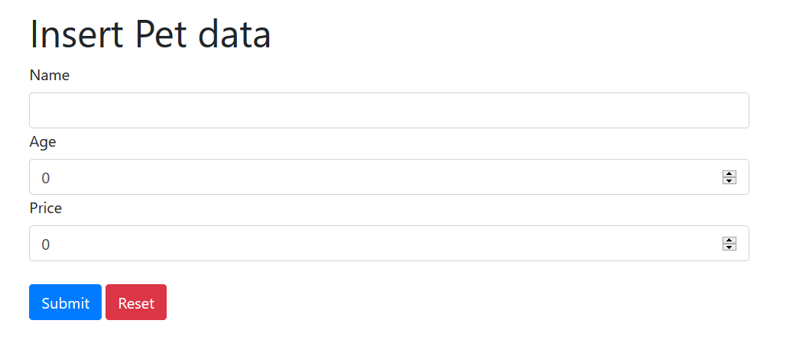

# spring-form-data-insertion
An example of a form implementation to insert and show data

<h3>Dependencies:</h3>
<ul>
  <li>spring-boot-starter-thymeleaf</li>
  <li>spring-boot-starter-web</li>
  <li>webjars-locator-core</li>
  <li>bootstrap</li>
</ul>  
<h3>To access the form go to : localhost:8080/ </h3>
